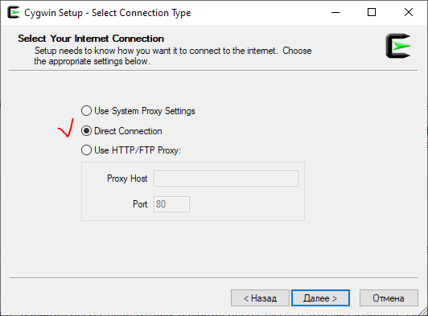
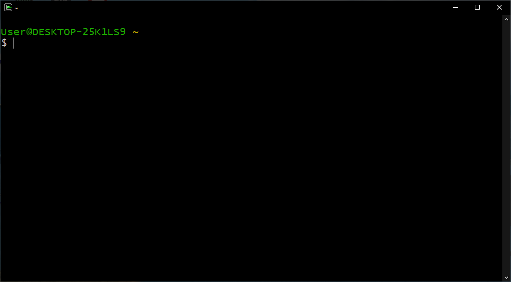
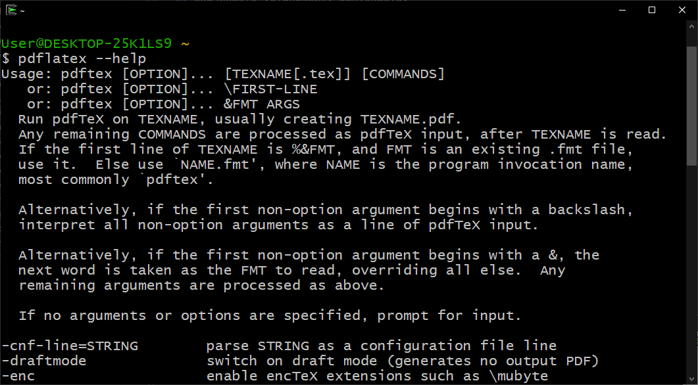

# Установка Cygwin

[Cygwin](https://www.cygwin.com/) -
это Unix-подобная среда для Windows.
Известным представителем Unix систем является
операционная система Linux.

```{note}
Установите Linux себе на компьютер - не пожалеете.
Систему можно поставить параллельно с Windows.
```

1. Перейдите на сайт [Cygwin](https://www.cygwin.com/).
2. В разделе "Installing Cygwin" ссылка на установщик:

   

3. Скачиваете установщик. Запускаете.
   Рекомендуется оставлять все настройки заданными по умолчанию.
   Нажимая "Далее", рано или поздно, увидите что-то такое:

   

Далее по картинкам:


Для работы с $\mathrm{\LaTeX}$ понадобятся следующие библиотеки:


После установки на рабочем столе (или в поиске) у вас появится
эмулятор терминала Cygwin.
Запустив его, увидите что-то подобное:



Готово!
Теперь вы можете работать в Windows, почти как в Linux.

```{note}
По умолчанию в Cygwin установлены все стандартные для Linux программы.
```

Для проверки того, установился ли компилятор латеха,
можно вызвать справку по программе командой

```bash
$ pdflatex --help
```

Результат должен быть следующим:



В противном случае программа `pdflatex` не установлена.

```{important}
Когда вам понадобится установить другие библиотеки,
просто снова скачайте установщик Cygwin
(или не удаляйте уже скачанный). Запустите его и выполните все те же махинации,
выбрав нужные пакеты из раздела "Not Installed".

Обновление установленных пакетов осуществляется также
через установщик.
```
