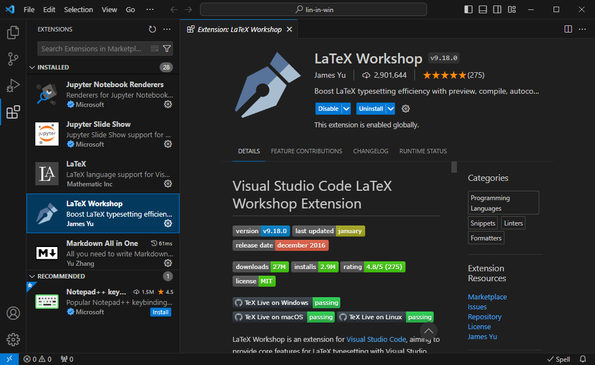
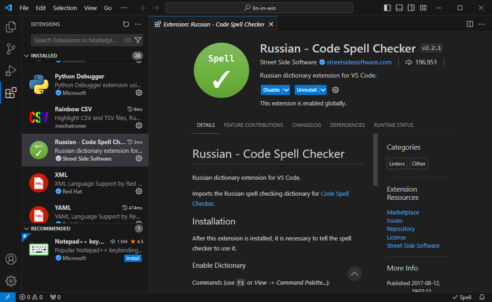
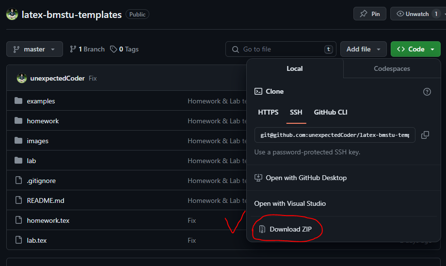

# Оформляем тексты в LaTeX

$\mathrm{\LaTeX}$ (произносится как "латех" с ударением на "е") -
это мощная профессиональная система вёрстки текстовых документов:
от буклетов до многотомных литературных и академических трудов.
Пы пишите (можно даже сказать, программируете) текст в файлах
с форматом `.tex`.
Затем передаёте эти файлы компилятору латеха
и на выходе получаете либо DVI, либо PDF файл
в зависимости от компилятора и его настроек
(как вы увидите, в этом нет никакой сложности).

Работу с латехом можно сделать одинаковой в Linux и Windows.
И мы это сделаем.
Тогда пользователи Windows будут выполнять те же действия,
что и линуксоиды, и получать тот же (прекрасный) результат.
Для этого необходимо немного прокачать Window, а именно,
установить эмулятор терминала Linux
[Cygwin](https://www.cygwin.com/).
Как это сделать, показано на странице
{doc}`cygwin-install` по установке самого Cygwin, а также
библиотек и компиляторов латеха.

Отныне будем считать, что вы работаете либо в Linux,
либо в Windows с установленным и настроенным Cygwin.

## Настраиваем VS Code

Для удобства работы с латехом рекомендуется установить
следующие расширения для VS Code:

* LaTeX Workshop - набор утилит для удобства создания
  файлов `.tex`:
  
  

* Russian - Code Spell Checker (проверка русской орфографии):

  

## Наш первый текст

Куда же без "Hello, world!"?
Создадим документ с такой фразой.

Создайте tex-файл, например, `main.tex`
и откройте его в VS Code.
Файлы латеха состоят из двух основных частей:
_преамбулы_ и _основной части_.

Основной текст - это текст, находящийся внутри _окружения_ `document`,
т.е. между командами

```latex
\begin{document}

% Здесь основной текст

\end{document}
```

Преамбула - это всё остальное, что находится **перед** командой
`\begin{document}`, т.е. перед основным текстом.

Наш хэллоу ворлд будет выглядеть как-то так:

```latex
\documentclass{report}      % общий стиль документа - отчёт
\usepackage[utf8]{inputenc} % кодировка символов

% Конец преамбулы.
% Начало основного текста
\begin{document}

Hello, world!

\end{document}

```

Настало время компилировать.
Открываем терминал (для пользователей Windows это означает
"открыть Cygwin") и переходим в директорию с нашим файлом.
Допустим, что файл в Windows находится по пути
`E:\tex-examples\hello.tex`.
Для этого даём команды:

```bash
$ cd e:
$ cd tex-examples
```

```{note}
В Linux пути отличаются.
Однако с большой долей вероятностью пользователи Linux
с лёгкостью перенесут эти инструкции на свои пути.
```

Перешли в директорию. Компилируем:

```bash
$ pdflatex hello.tex
```

Готово!
В той же директории вы получите одноимённый файл PDF (`hello.pdf`).
Откройте его - и вы увидите приветствие миру.

```{note}
Существует множество компиляторов $\mathrm{\LaTeX}$:
`pdflatex`, `xelatex`, `latex` и многие другие.
Если бы мы заменили `pdflatex`, например, на `latex`,
то на выходе получили бы файл формата DVI.
```

Вот и всё! Всего-то!
_Но есть нюанс..._
Реальность сложнее.
Например, мы не можем пока создать документ с русским языком
(вернее, с кириллическим шрифтом).
Нужно также уметь настраивать геометрию страниц, размер шрифта,
стиль математических формул, таблиц, рисунков
и так далее и тому подобное.
В данном пособии эти вопросы подробно не рассматриваются.
Всю необходимую информацию вы найдёте в интернете и в литературе,
к примеру, в следующих книгах
(расположены в порядке убывания первоочерёдности):

1. ["$\mathrm{\LaTeX}$ по-русски"](https://elitagroup.ru/content/school/web/20170130/Latex_rus.pdf) Котельникова;
2. ["Набор и вёрстка в системе $\mathrm{\LaTeX}$"](https://mccme.ru/free-books/llang/newllang.pdf) Львовского;
3. ["Основы $\mathrm{\LaTeX}$"](https://ctan.math.washington.edu/tex-archive/info/russian/basiclatex-ru/BasicLatex.pdf). Учебное пособие Кузнецова.

```{note}
Этой литературы в большинстве случаев оказывается достаточно,
чтобы за пару дней освоить $\mathrm{\LaTeX}$
на уровне оформления диплома.
Не нужно читать книги полностью и последовательно.
Достаточно прочитать разделы с основами создания документов,
а остальные разделы, где подробно рассматривается какой-либо
функционал, просматривать по мере необходимости.
```

В следующем разделе рассмотрим более сложный пример
$\mathrm{\LaTeX}$-файла,
содержащего шаблон оформления домашнего задания.

## Обзор шаблона документа $\mathrm{\LaTeX}$

Шаблоны текстовых документов,
оформляемых студентами МГТУ им. Н.Э. Баумана,
вы найдёте в [этом репозитории](https://github.com/unexpectedCoder/latex-bmstu-templates).
Скачайте его себе, например, как zip-архив:



Для примера рассмотрим содержимое файла `homework.tex` -
шаблона домашнего задания.
Пойдём по небольшим частям.
Для начала рассмотрим преамбулу.

```latex
%%% homework.tex %%%
% Класс документа - расширенный отчёт
\documentclass[14pt, a4paper]{extreport}
% Кодировка UTF-8
\usepackage[utf8]{inputenc}
% Подключаем кириллицу
\usepackage[T2A]{fontenc}
% Подключаем стиль для английского и русского текста
\usepackage[english, russian]{babel}
 % Делаем заголовок "Содержание" для содержания
 % вместо "Оглавления" по умолчанию,
 % выравнивая по центру
 \addto\captionsrussian{
  \renewcommand{\contentsname}
    {\begin{center}
        \bfseries\large Содержание
    \end{center}}
 }
```

Продолжаем настройку.
Настроим абзацы, шрифты, геометрию страниц:

```latex
% Первый абзац после заголовка - с красной строки
% (у англичан первый абзац не имеет отступа)
\usepackage{indentfirst}
% Пакет для оформления математических формул
\usepackage[intlimits, sumlimits]{amsmath}
% Пакет с греческими буквами прямого начертания
% (как принято в отечественной печати)
\usepackage{upgreek}
% Современный шрифт для математики
\usepackage{newtxmath}
% Пакет для работы с таблицами
\usepackage{tabularx}
```

Настраиваем геометрию страниц:

```latex
% Настраиваем геометрию страниц:
\usepackage{geometry}
 \geometry{
    includefoot,
    footskip=1cm,
    left=3cm,
    top=1.5cm,
    right=1cm,
    bottom=1.5cm
 }
```

Далее - мелочи:

```latex
% Для настройки межстрочного интервала
\usepackage{setspace}
% Для настройки стилей заголовков
\usepackage{titlesec}
% Для табуляций
\usepackage{tabto}
% Для работы с рисунками
\usepackage{graphicx}
 % Директория с картинками
 \graphicspath{{./images/}}
% Для работы с многофайловым проектом
\usepackage{subfiles}
% Для подсчёта суммарного числа страниц
\usepackage{totpages}
% Булева логика (программирование)
\usepackage{ifthen}
```

Далее создаётся шаблон титульной страницы.
Опустим его разбор.
Вы легко с ним разберётесь, как только познаете основы
$\mathrm{\LaTeX}$.

```latex
% Величина отступа (красной строки)
\setlength\parindent{1.25cm}
% Настраиваем стили заголовков
\titleformat*{\section}{\large\bfseries}
\titlespacing*{\section}{1.25cm}{6pt}{6pt}
\titleformat*{\subsection}{\normalsize\bfseries}
\titlespacing*{\subsection}{1.25cm}{6pt}{6pt}

% Делаем чистовик, в не черновик (\fussy)
\sloppy
```

Переходим к основной части документа:

```latex
\begin{document}

% Внесите информацию для формирования титульного листа
\TitlePage
{Дисциплина}
{Тема}
{7}                     % вариант
{СМ6-113}               % группа
{И.Р.~Иванов-Римский}   % и.о. фамилия студента
{П.П.~Петров}           % и.о. фамилия преподавателя

% Настроили межстрочный интервал
\setstretch{1.5}

% Создаём новую команду:
% содержание будет отображено автоматически,
% если объём работы превысит 10 страниц
\newcommand\ConditionalTOC{
  \ifthenelse{\pageref{LastPage} > 10}{
    \tableofcontents
    \clearpage
  }{}
}

% Вызываем функцию условного отображения содержания
\ConditionalTOC

% Отключаем нумерацию разделов
\setcounter{secnumdepth}{0}

% Разделы ДЗ:
% ваша задача - описать решение ДЗ в трёх нижеследующих файлах
% (подробности см. в указанных файлах)
\subfile{homework/1_task}
\subfile{homework/2_method}
\subfile{homework/3_results}

% Метка последней страницы, чтобы достать её номер
\label{LastPage}

\end{document}
```

**Хорошая новость** в том,
что **вам не нужно ничего менять в данном файле**.
Всё, что от вас требуется - передать необходимые аргументы
функции `\TitlePage` для генерации титульной страницы.

Ваша основная работа (написание отчёта по той или иной работе)
заключается в написании текста в файлах разделов.
Это те файлы, что переданы функции `\subfile`.
Например, для ДЗ эти файлы лежат в директории `homework/`,
для лабораторной работы - в директории `lab/`.
Вы просто пишите то, что считаете нужным написать в файлах разделов,
включая таблицы, рисунки, формулы и прочее.
И затем тем же самым образом компилируете итоговый файл:

```bash
$ pdflatex homework.tex
```

или для отчёта по лабораторной работе:

```bash
$ pdflatex lab.tex
```

При этом в _субфайлах_ нет необходимости снова подключать какие-либо
пакеты - все они уже подключены в основном файле.
Всё же и субфайлы имеют определённую строгую структуру.
Для примера рассмотрим файл `homework/1_task.tex`:

```latex
%%% homework/1_task.tex %%%
% Преамбула субфайла:
% указываем главный файл
\documentclass[../homework.tex]{subfiles}
 % указываем директорию картинок
 \graphicspath{{\subfix{../images/}}}
% Конец преамбулы

% Начало основной части
\begin{document}

% Заголовок раздела
\section{Задание}
% Здесь описываете вашу задачу ДЗ
% ...

\end{document}
```

Преамбула всех субфайлов, как правило, одинакова.

## См. также

1. ["$\mathrm{\LaTeX}$ по-русски"](https://elitagroup.ru/content/school/web/20170130/Latex_rus.pdf) Котельникова.
2. ["Набор и вёрстка в системе $\mathrm{\LaTeX}$"](https://mccme.ru/free-books/llang/newllang.pdf) Львовского.
3. ["Основы $\mathrm{\LaTeX}$"](https://ctan.math.washington.edu/tex-archive/info/russian/basiclatex-ru/BasicLatex.pdf). Учебное пособие Кузнецова.
4. [Cygwin](https://www.cygwin.com/) - Unix-подобная среда для Windows.
