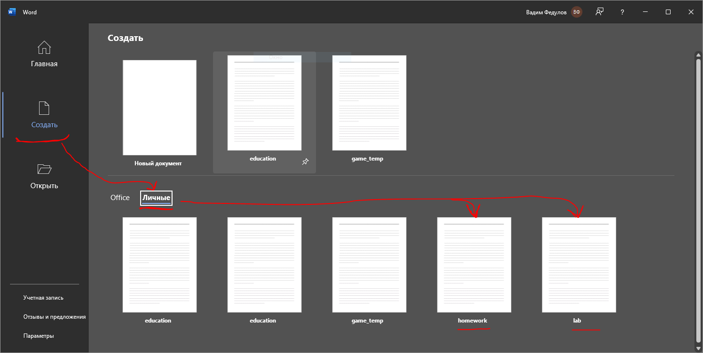
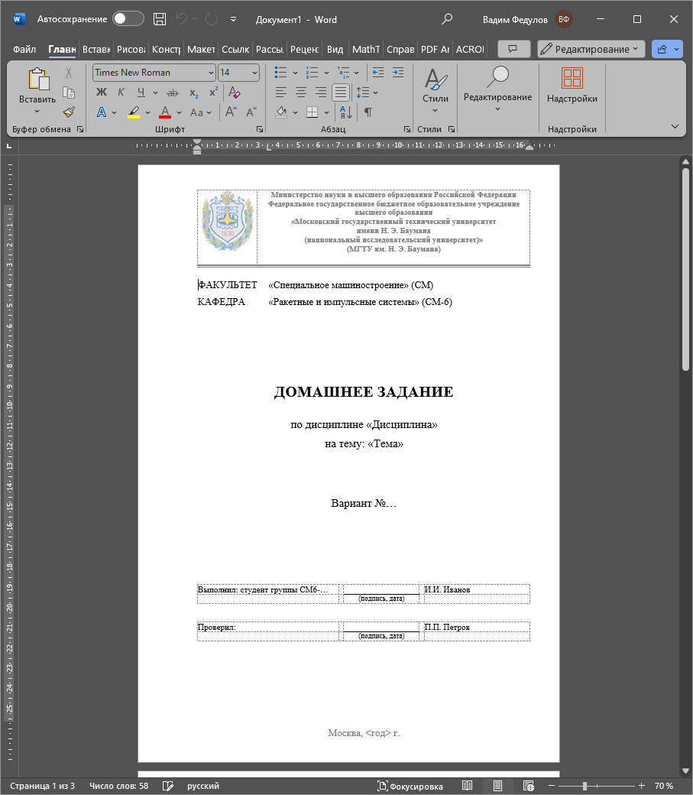
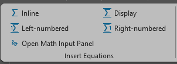
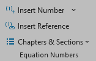
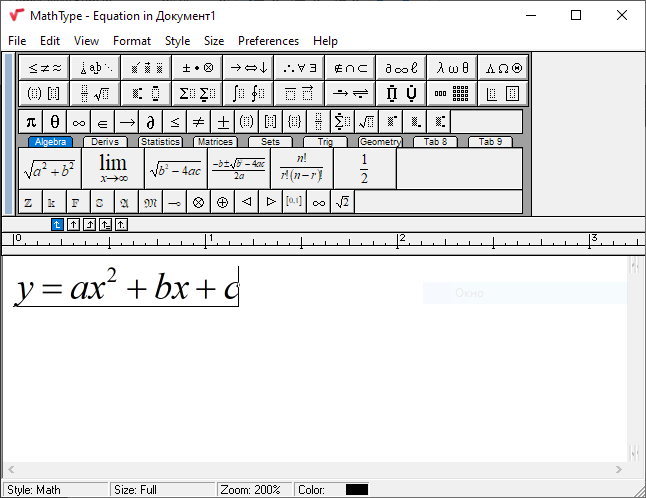
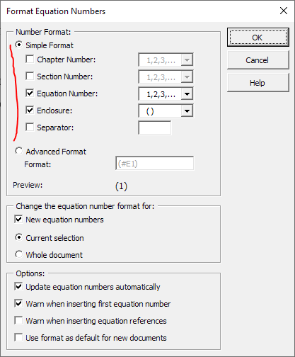
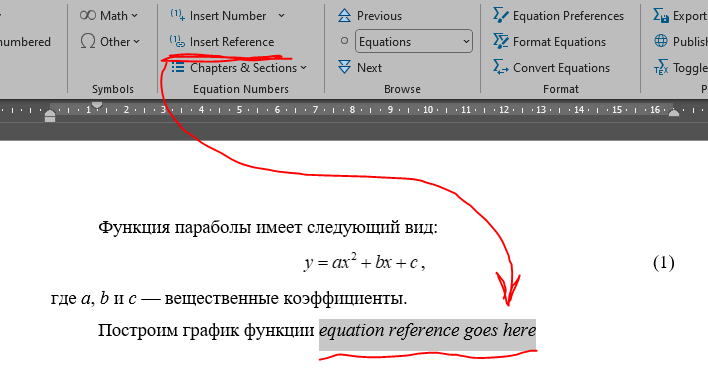

# Оформляем тексты в MS Word

Вкратце рассмотрим, как автоматизировать работу в MS Word
и делать в нём _качественные_ текстовые документы.

Под качественным текстовым документов будем подразумевать
работу без стилевых ошибок (прыгающие абзацы, разные шрифты и т.д.),
без ошибок в оформлении (вид титульной страницы, нумерация страниц,
подписи рисунков и таблиц и т.д.),
с грамотным изложением результатов той или иной работы.

Шаблоны для оформления студенческих работ в Word
вы найдёте [здесь](https://drive.google.com/drive/folders/1qFY8iDDT2aZDxh1ogmOBpyUHpi0wQO2a?usp=sharing).

## Что за шаблоны и зачем они нужны?

Шаблон Word - это файл, на основе которого можно создать новый документ.
Шаблон хранит в себе настроенные стили основного текста, заголовков,
подписей рисунков и таблиц и т.д.
Современный формат файла Word - `.docx`, а шаблона - `.dotx`.

Пользовательские шаблоны Word по умолчанию хранятся по пути
`C:\<User>\Документы\Настраиваемые шаблоны Office\<template>.dotx`.
При запуске Word просматривает эту директорию,
поэтому вы можете увидеть все свои шаблоны в самом Word:



```{note}
Чтобы у вас появились шаблоны `homework` и `lab`, как на картинке выше,
вы должны скачать их по [ссылке](https://drive.google.com/drive/folders/1qFY8iDDT2aZDxh1ogmOBpyUHpi0wQO2a?usp=sharing) и переместить
в указанную папку шаблонов Word.
```

Нажав на соответствующий шаблон вы создадите `docx`-файл,
оформленный по выбранному шаблону.



Как видите из скриншота выше, в новом файле уже есть титульная страница.
Также есть страница с содержанием работы и пустая страница
с заголовками разделов домашнего задания.
Стили заголовков, основного текста и т.д. тоже уже настроены
(см. скриншот ниже):


Вам остаётся лишь заполнить титульный лист,
удалить или оставить содержание (в зависимости от объёма отчёта)
и написать сам отчёт.

## Оформляем формулы в Word

Здесь рассмотрим способы написания математических выражений
в MS Word, "фишки" распространённых формульных редакторов,
а также основные требования к оформлению технических
(и математических) текстов, с которыми вы обязательно столкнётесь.

### Используем встроенный редактор

```{important}
Согласно требованиям МГТУ шрифт в формулах должен совпадать
со шрифтом основного текста.
**Встроенный редактор Word не может это обеспечить.**
Этого недостатка лишён редактор MathType.
```

В связи с замечанием, сделанном выше, оформление текстовых работ
с использованием встроенного редактора формул бессмысленно
с точки зрения удовлетворения требованиям МГТУ
(и подавляющего большинства издательств).
Однако встроенный редактор вполне можно использовать в презентациях.
Поэтому всё же покажем некоторые его "фишки",
которые помогают немного ускорить набор формул.

Самое главная "фишка" - поддержка синтаксиса и команд $\mathrm{\LaTeX}$.
Например, не стоит тратить время на поиск греческих символов в таблице.
Вместо этого достаточно ввести её название в самой формуле,
начиная с символа обратного слэша `\<command>`: `\alpha`.
Команда сработает после нажатия пробела:

* до нажатия пробела:


* и после:


Также, как в латехе, работает вставка нижних и верхних индексов
(с нажатием пробела):

* до:


* после:


С помощью пробела можно вставить дробь (`/` + пробел),
растягивающиеся скобки любой формы (`()` + пробел, `[]` + пробел и т.д.).

Работают и такие команды латеха, как `\mathbb{R}`
(отобразится $\mathbb{R}$).

Как только погрузитесь в оформление разнообразных отчётов,
вы быстро освоите и синтаксис формул и часто используемые команды.

### Используем MathType

MathType - это коммерческая программа оформления формул
с многофункциональной надстройкой для Word:


Раскрыв надстройку, вы увидите:


В разделе "Insert Equations" расположены кнопки вставки
уравнений:



* "Inline" - вставка формулы посреди основного текста
  (встраивание формулы в предложение);
* "Display" - вставка центрированной формулы;
* "Left-numbered" и "Right-numbered" - то же, что и "Display",
  но с номером формулы слева или справа соответственно.

Для вставки встроенной формулы можно использовать комбинацию клавиш
`Ctrl`+`Alt`+`Q`, а для вставки центрированной формулы
`Ctrl`+`Q`.
При этом откроется окно редактора:


Верхняя панель содержит функции MathType.
Однако каждая команда имеет собственное сочетание клавиш
для своего вызова.
Вы можете узнать эти сочетания,
наводя указатель на интересующую команду
и смотря в нижний левый угол окна редактора.
Например, сочетание для вставки полноразмерной дроби
`Ctrl`+`F`.

В разделе "Symbols" расположены различные символы,
не представленные на клавиатуре, например, греческие:


Эти же символы можно найти в стандартной вкладке "Вставка".

Далее рассмотрим раздел "Equation Numbers":



* "Insert Number" - вставить номер формулы;
* "Insert Reference" - вставить ссылку на формулу;
* "Chapters & Sections" - вставка разделов.
  Это нужно в случае, если формулы нумеруются с учётом номера раздела.
  Например, вторая формула в первом разделе имеет номер (1.1).
  Возможны и более сложные случаи.

Опустим остальные разделы, кроме "Format":


Его предназначение в том, чтобы настроить стиль формул, шрифты и т.д.,
а также в том, чтобы отформатировать все уравнения в документе,
если настройки оформления были изменены.

### Пример

Напишем следующий текст:


После двоеточия нажмите `Alt`+`Q`.
Откроется окно редактора.
Введите формулу.
Обратите внимание, что шрифт по
умолчанию Times New Roman.



Для завершения редактирования
просто закройте редактор.

Установив каретку в любом месте
строки с формулой.
Заметьте, что на горизонтальной
линейке установлены знаки табуляции
(это сделал MathType автоматически):


Справа от формулы вы могли заметить её номер.
Для этого перейдите на строку с
формулой в место за ней.
Нажмите `Tab` - каретка переместится к
следующему (крайне правому) знаку табуляции.
Затем на вкладке MathType в разделе
"Equation Numbers" нажмите
"Insert Number".
Раскроется "шторка" с двумя командами:
"Insert" и "Format".
Для начала стоит определить формат номера.
В данном случае снята галочка с "Section Number":



Затем, нажмите "Ок".
Теперь вставьте номер командой "Insert".

Чтобы вставить ссылку на формулу в тексте,
нажмите "Insert Reference".
Появится место для вставки,
как на рисунке ниже:



Чтобы в указанном месте появился номер уравнения,
просто дважды щёлкните на её номере.
Результат:


```{note}
Номера формул и ссылки на них обновляются автоматически.
```

```{important}
Основным недостатком MS Word и многих программ, связанных с ним,
является то, что их лицензии стоят денег.
$\mathrm{\LaTeX}$ свободен и бесплатен.
```

Таковы основы работы с MathType.

## См. также

1. [Шаблоны Word](https://drive.google.com/drive/folders/1qFY8iDDT2aZDxh1ogmOBpyUHpi0wQO2a?usp=sharing)
   для студенческих работ.
2. [Купить MathType](https://store.wiris.com/en/products/mathtype/download/windows).
