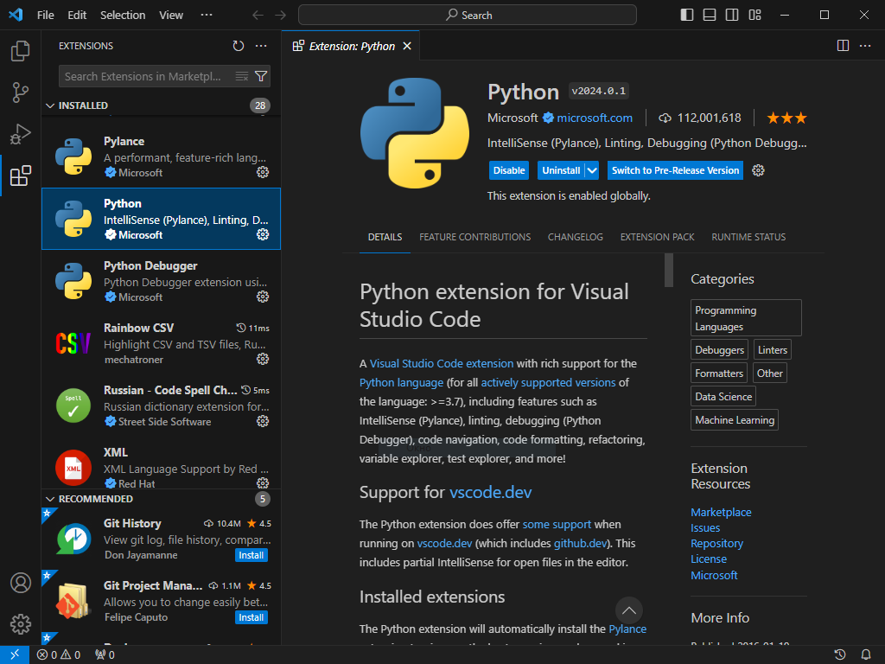
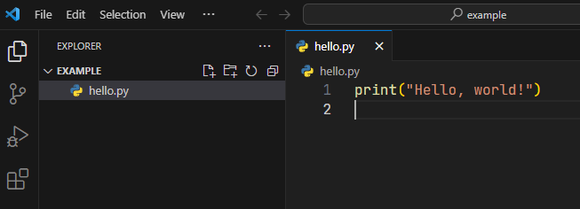
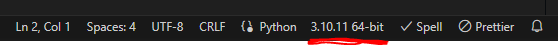
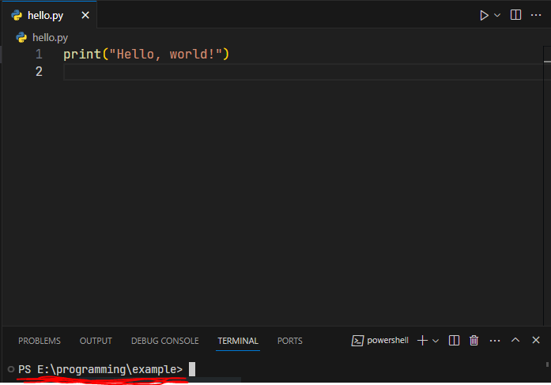
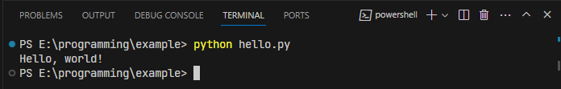
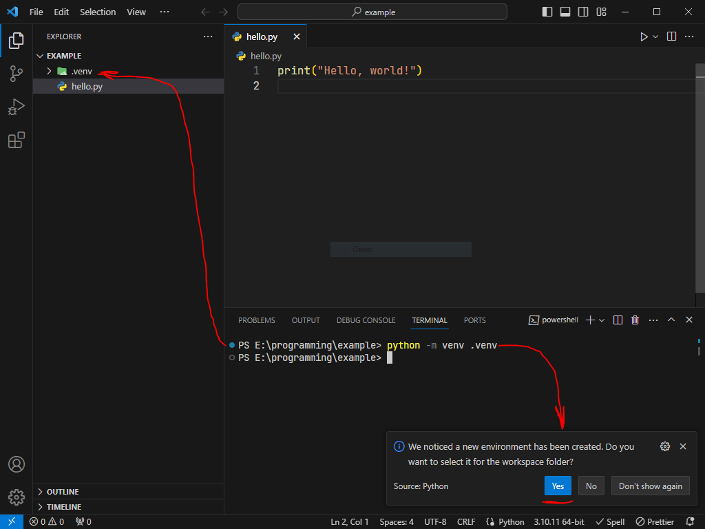
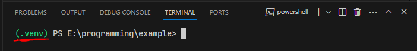
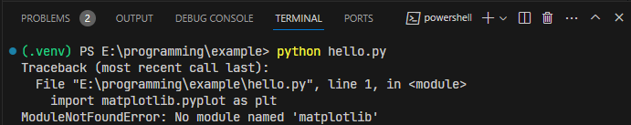
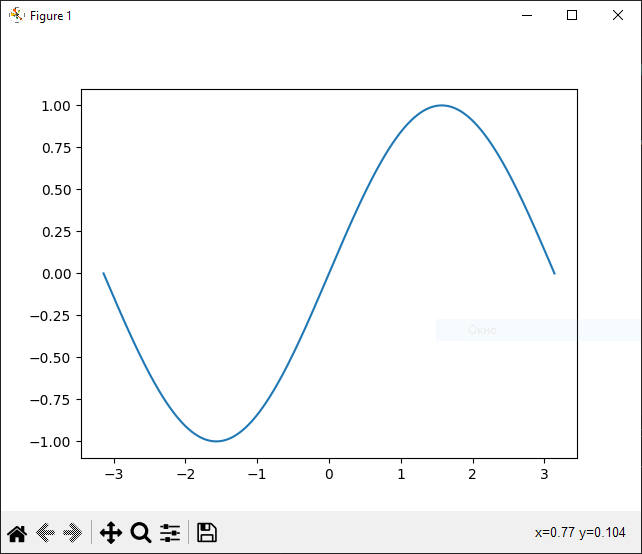

# Создаём программы Python в VS Code

Обсудим практику создания и написания программ
на языке программирования Python.

## Установка интерпретатора Python 3

В Linux интерпретатор Python 3 установлен по умолчанию.

В Windows интерпретатор Python 3 нужно установить.
Интерпретатор Python - бесплатная и свободно распространяемая
программа.
Скачать установщик можно [здесь](https://www.python.org/downloads/release/python-3109/).

```{important}
При установке отметьте включение интерпретатора в
глобальную переменную среды `PATH`.
Это сделает его доступным в PowerShell.
Чтобы проверить, что интерпретатор установлен,
откройте PowerShell и выполните команду:

`$ python -V`

В результате вы должны увидеть либо информацию о версии
интерпретатора, либо сообщение о том, что имя
программы "python" неизвестно.

Если вы не включили программу в `PATH` при установке,
это можно сделать вручную.
См. ["Как добавить переменную в PATH"](https://lumpics.ru/how-to-add-path-to-path-in-windows-10/?ysclid=lsg4yezth395030274).
```

## Настраиваем VS Code

Для начала установим основное расширение для
работы с кодом Python:



С данным расширением установится множество связанных расширений:
подсветка синтаксиса, контекстные подсказки и т.д.

Данное расширение активируется автоматически,
как только вы открываете или создаёте Python-файл
(файл с расширением `.py`).

## Пример проекта

1. Создайте папку проекта-примера и откройте эту папку в VS Code.
2. Откройте эту директорию в VS Code:
   File->Open Folder...
3. Создайте файл, например, `hello.py`.
   Напишите простую программу "Hello, world!":

   

   ```python
   ### hello.py ###
   print("Hello, world!")
   ```

4. Обратите внимание на нижний правый угол окна VS Code:
   
   

   Поскольку установленный интерпретатор известен операционной системе,
   то он известен и VS Code.
   Поэтому автоматически установлен данный _системный_ интерпретатор.
5. Откройте терминал VS Code, например,
   сочетанием клавиш `Ctrl`+`Shift`+`~`.
   При этом в Windows 10 терминалом является PowerShell
   (на скриншоте ниже), в Linux - терминал bash.

   

6. Теперь запустите написанную программу,
   дав команду `python hello.py`:
   
   

```{important}
Работа в системном терминале через VS Code обладает
очень важным преимуществом - вы можете выполнять одинаковые
команды в одинаковом формате как в Windows, так и в Linux.
```

Использование глобального (системного) интерпретатора
является не очень хорошей практикой.
Можно даже сказать - это плохая практика.
Лучше использовать локальный интерпретатор, называемый
_виртуальным окружением_.

### Настраиваем локальный интерпретатор

1. В открытом в VS Code терминале выполните команду:
   
   ```bash
   $ python -m venv .venv
   ```
   
   Данная команда означает следующее:
   "Python, возьми свой модуль `venv` для создания
   виртуальных окружений и создай локальный интерпретатор
   в директории `.venv/`".

   ```{note}
   Если модуль `venv` не установлен, то его можно установить
   командой `python -m pip install virtualenv`.
   ```

   

   Заметьте, что интерпретатор изменился:

   

2. Закройте терминал (символ корзины) и откройте его вновь.
   Теперь терминал откроется с виртуальным окружением:

   

3. Выполнив теперь команду `$ python hello.py`,
   вы запустите не системный, а локальный интерпретатор
   из директории `.venv/`.

Почему эта практика лучше предыдущей?
Предположим, что в нашей программе появилась необходимость
строить графики и производить математические расчёты,
например, с использованием библиотек Matplotlib и NumPy.

Для примера построим часть синусоиды.
Если мы напишем и запустим такой код:

```python
### hello.py ###
import matplotlib.pyplot as plt
import numpy as np

x = np.linspace(-np.pi, np.pi, 300)
y = np.sin(x)

fig, ax = plt.subplots()
ax.plot(x, y)
plt.show()
```

То при запуске получим ошибку:



Указанные библиотеки не установлены в локальном
интерпретаторе (виртуальном окружении).

Исправим ситуацию, установив библиотеки в виртуальное окружение:

```bash
$ pip install numpy matplotlib
```

Запустите программу ещё раз - и получите результат:



Так вот - ценность виртуального окружения в том,
что вы оно локально, все библиотеки, которые вы устанавливаете,
устанавливаются локально.
Это упрощает управление зависимостями, версиями библиотек
и т.д.
Это особенно ценно в Linux ввиду того, что в этой системе
Python является одной из важных системных программ:
если вы его повредите, установите библиотеки,
не поддерживающие функциональность каких-либо системных программ,
то можете нарушить работоспособность системы.
Виртуальное окружение никак не связано с системным.

Описанным образом с помощью VS Code можно создавать
очень большие и сложные программы.
